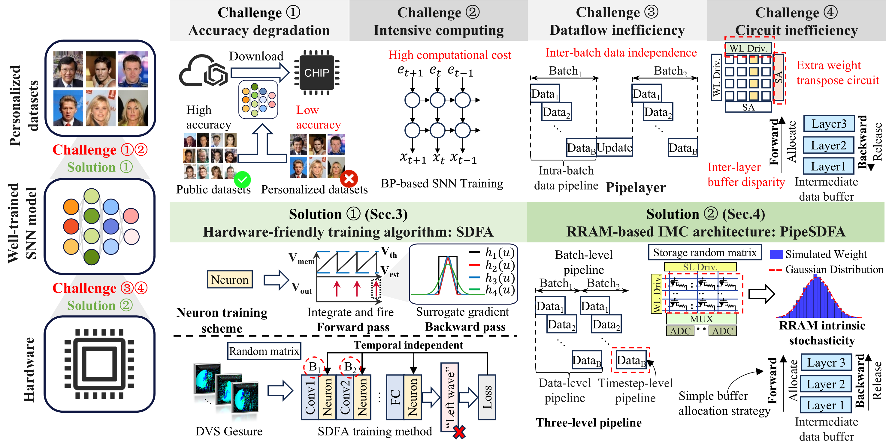

# When Pipelined In-Memory Accelerators Meet Spiking Direct Feedback Alignment: A Co-Design for Neuromorphic Edge Computing [[pdf](https://arxiv.org/abs/2507.15603)]

> **Accepted at ICCAD 2025**



---

:rocket: :rocket: :rocket: **News**

- **Jul. 21, 2025**: Release the code for SDFA training.


## Abstract
Spiking Neural Networks (SNNs) are increasingly favored for deployment on resource-constrained edge devices due to their energy-efficient and event-driven processing capabilities. However, training SNNs remains challenging because of the computational intensity of traditional backpropagation algorithms adapted for spike-based systems. In this paper, we propose a novel software-hardware co-design that introduces a hardware-friendly training algorithm, Spiking Direct Feedback Alignment (SDFA) and implement it on a Resistive Random Access Memory (RRAM)-based In-Memory Computing (IMC) architecture, referred to as PipeSDFA, to accelerate SNN training. Software-wise, the computational complexity of SNN training is reduced by the SDFA through the elimination of sequential error propagation. Hardware-wise, a three-level pipelined dataflow is designed based on IMC architecture to parallelize the training process. Experimental results demonstrate that the PipeSDFA training accelerator incurs less than 2\% accuracy loss on five datasets compared to baselines, while achieving 1.1x\~10.5x and 1.37x\~2.1x reductions in training time and energy consumption, respectively compared to PipeLayer.


## Results
We conducted experiments using four MLPs and two CNNs as shown in Table \ref{tab:model_acc} on the N-MNIST, DVS-Gesture, Spiking Heidelberg Dataset, Braille letter and N-Caltech101 to evaluate our proposed SDFA algorithm and conducted five repeated runs for statistical robustness. To compare effectiveness of the SDFA, we used BP-based method to train models on various datasets as our baselines.

|Dataset|Number of classes|Neuron type|Model|Setup|Acc(%),BP|ACC(%),This work|Model|
|---|---|---|---|---|---|---|---|
|NMNIST|10|LIF|MLP-A|2 X FC|98.52|97.92||
|NMNIST|10|LIF|MLP-A|3 X FC|98.46|97.97|
|NMNIST|10|LIF|MLP-A|4 X FC|98.38|97.95|
|NMNIST|10|LIF|MLP-A|5 X FC|97.87|97.82|
|SHD|20|IF|MLP-B|3 X FC|74.09|73.29|[Download](https://drive.google.com/file/d/1NEOjwpAolEYoHPp-umqxDq2gk-WkC275/view?usp=sharing)|
|Braille letter|28|IF|MLP-B|3 X FC|99.62|99.26|[Download](https://drive.google.com/file/d/1dvRBO9eT_UDLa6rO0cjwzCRbUlIRDt2n/view?usp=sharing)|
|DVS-Gesture|11|IF|ConvNet|5 X Conv + 2 X FC|95.14|93.75|[Download](https://drive.google.com/file/d/1xEA49Ni0FvyECKycsquXGgvfV6-F3HGK/view?usp=sharing)|
|DVS-Gesture|11|IF|VGG11|8 X Conv + 3 X FC|88.92|92.36|[Download](https://drive.google.com/file/d/1RIFhON9u1lT1oK3WRaYEJ5YDzaaalEGf/view?usp=sharing)|
|N-Caltech|101|IF|VGG11|8 X Conv + 3 X FC|59.53|64.38|

## Geting Started

### Prerequisites
- torch == 2.4.1
- spikingjelly == 0.0.0.0.14
- cupy(optional)

### Running the Code
1. Clone this repository

```bash
git clone https://github.com/HershelYen/Spiking-Direct-Feedback-Alignment.git
```

2. Install dependecies
Please indicate your path to the Dataset under `conf` filefolder

3. Run the train script

Example
```bash
python train.py --config conf\NMNIST\mlpa.yml
```

### Validate Model Accuracy
1. Download model checkpoints or train yourself.
2. Put `*.pth` file under `checkpoints` filefolder.
3. Run the validate script

Example
```bash
python validate.py --config conf\DVS_Gesture\val_conv.yml
```

## Citation
If you find this code useful and helpful to your work, please kindly cite the paper
```
@article{renWhen2025,
  title = {When Pipelined In-Memory Accelerators Meet Spiking Direct Feedback Alignment: A Co-Design for Neuromorphic Edge Computing},
  author = {Ren, Haoxiong and He, Yangu and Wong, Kwunhang and Bao, Rui and Lin, Ning and Wang, Zhongrui and Shang, Dashan},
  year = {2025},
  booktitle={2023 IEEE/ACM International Conference on Computer Aided Design (ICCAD)}, 
}
```